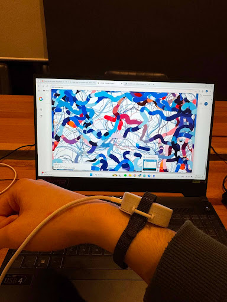
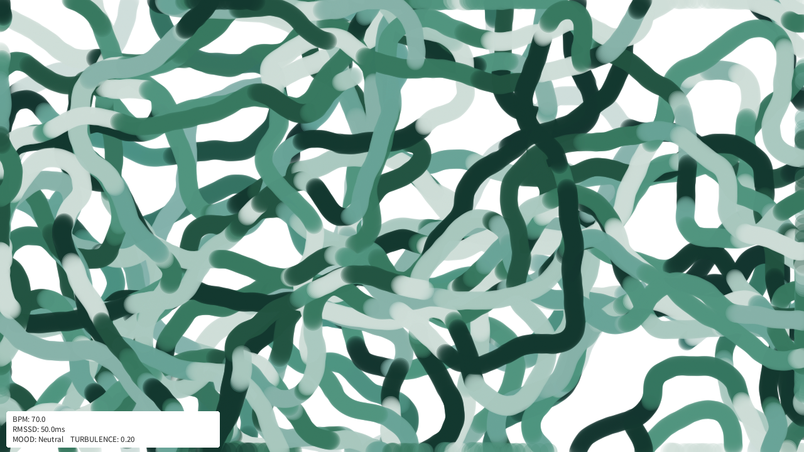
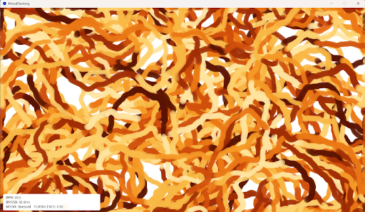
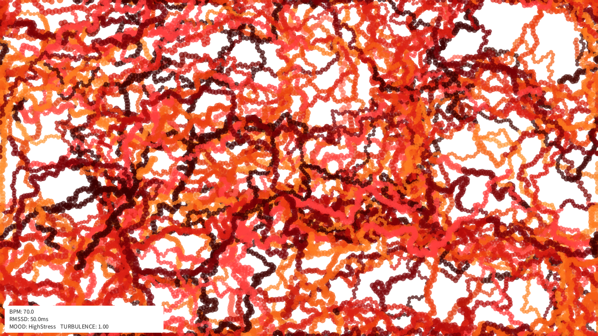
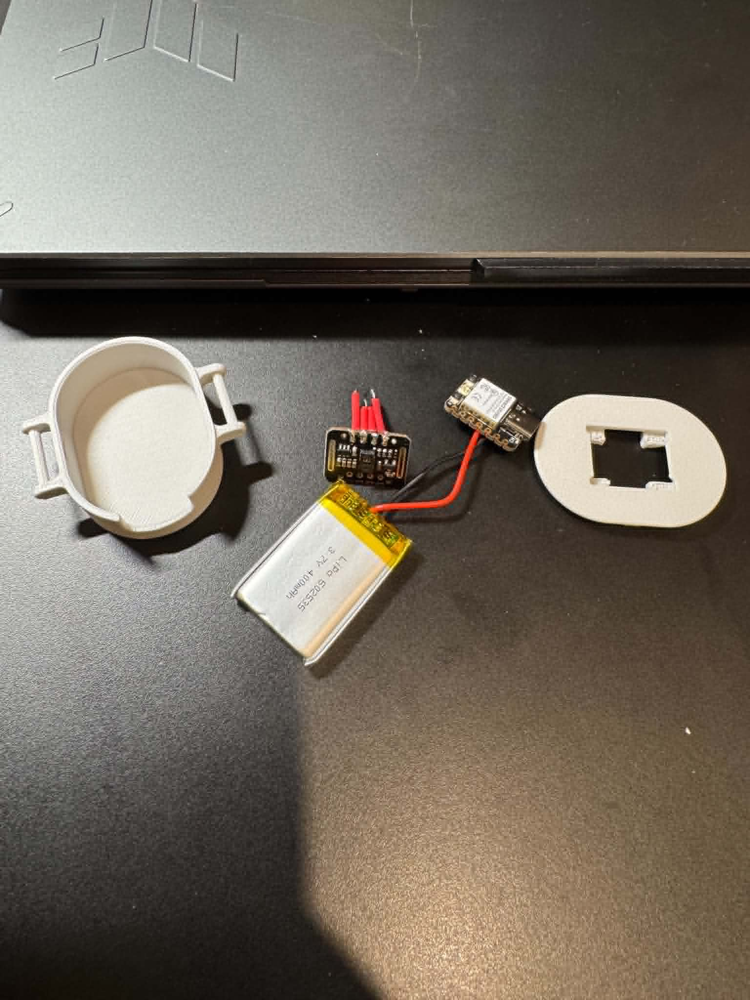
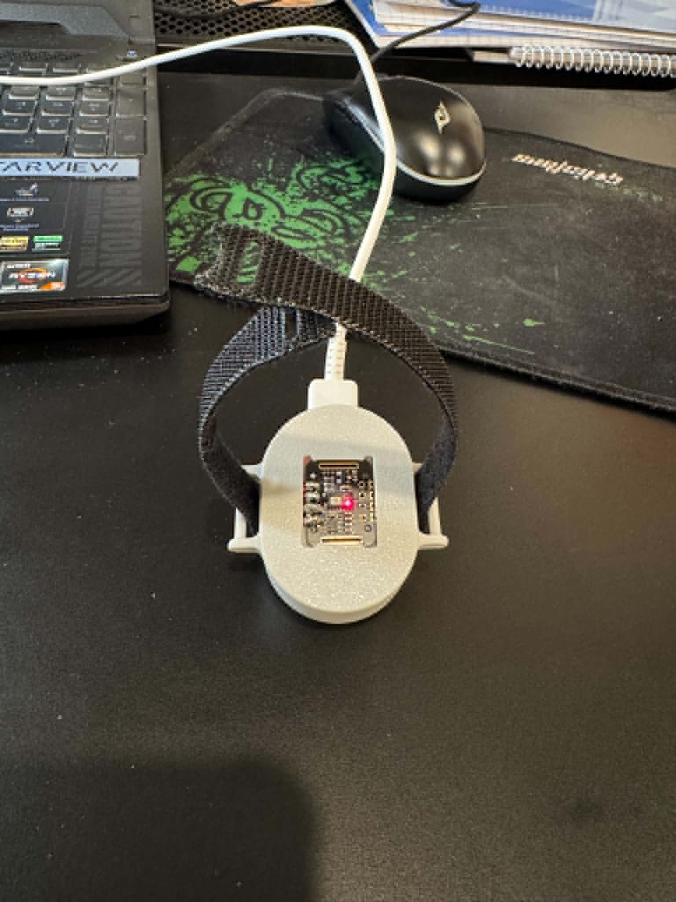
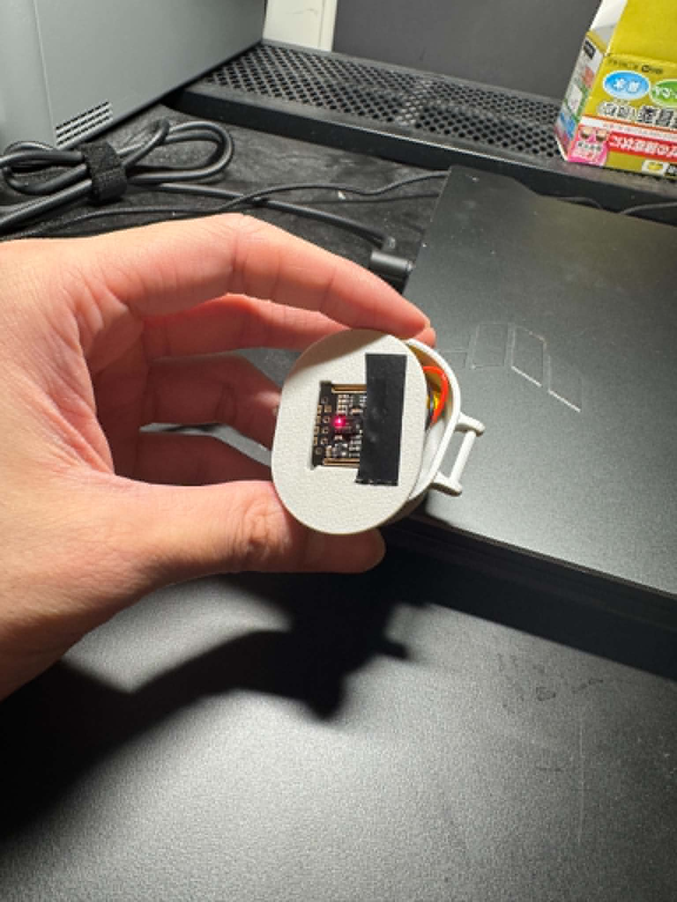

# Mood Paintings

A real-time generative art system that paints with your heartbeat.

A MAX30102 pulse oximeter reads your heart rate and heart rate variability (HRV) from a wrist-worn device, classifies your current stress level using a personal baseline calibration algorithm, and transmits the data wirelessly over UDP to a fullscreen Processing visualiser — which responds with colour, motion, and turbulence that reflect your physiological state in real time.




## Motivation

> "Nếu không có gì xoa dịu được nỗi buồn của bạn,  
> tôi mong nỗi buồn đó có thể xoa dịu chính bạn."
>
> *"If nothing can soothe your sadness,  
> I hope sadness itself can soothe you."*

Sometimes feelings are overwhelming and indescribable. Even when you feel them weighing
heavily your chest, you don't know how to deal with them. This device doesn't offer a solution,
but it offers something else: it visualises your feelings and turns them into artwork.

When you look at your mood painting, my hope is that you find some comfort knowing 
that even your most difficult and negative emotions can become something beautiful.

---

## Mood states

Each mood produces a distinct visual signature:

| Mood | Colours | Motion |
|---|---|---|
| **Calm** | Midnight navy → sky blue | Slow, drifting brush strokes |
| **Neutral** | Deep forest → sage teal | Moderate, flowing movement |
| **Stressed** | Rust → amber | Fast, erratic brushes |
| **High Stress** | Crimson → burning orange | Violent, chaotic turbulence |

### Gallery

<table>
  <tr>
    <td align="center"><br/><sub>Neutral — RMSSD: 50ms, Turbulence: 0.20</sub></td>
    <td align="center"><br/><sub>Stressed — Turbulence: 0.55</sub></td>
  </tr>
  <tr>
    <td align="center" colspan="2"><br/><sub>High Stress — Turbulence: 1.00</sub></td>
  </tr>
</table>

---

## Hardware

A custom wearable device built from scratch:

<table>
  <tr>
    <td align="center"><br/><sub>Components: MAX30102 sensor, XIAO ESP32, LiPo battery, 3D printed casing</sub></td>
    <td align="center"><br/><sub>Assembled wearable with wrist strap</sub></td>
    <td align="center"><br/><sub>Sensor module close-up</sub></td>
  </tr>
</table>

**Components:**
- Seeed XIAO ESP32 microcontroller
- Generic MAX30102 pulse oximeter / heart rate sensor (raw ADC data)
- 400mAh LiPo battery
- 3D printed casing (adapted from Stanford HeartBeet project)
- Velcro wrist strap

---

## How it works

```

Finger/wrist → MAX30102 Sensor → XIAO ESP32

↓

BPM calculated (rolling 4-beat average)
RMSSD calculated from RR intervals
Personal baseline calibrated (first valid 10 beats)
Mood classified against personal thresholds

↓

UDP packet over WiFi — `"BPM:72,RMSSD:44.3,MOOD:Calm"`

↓

Processing visualiser (port 5005)
Colour palette interpolated
12 brush agents update speed + size
Turbulence field responds
```

---

## Technical details

### Heart rate variability (HRV) — RMSSD
The system measures **RMSSD** (Root Mean Square of Successive Differences) — the standard clinical metric for autonomic nervous system activity. Higher RMSSD = more parasympathetic activity = calmer physiological state.

```
RMSSD = sqrt( sum(ΔRR²) / (N-1) )
```

Computed from 10 successive RR interval differences, with motion artefact rejection gating intervals > 200ms.

### Personal baseline calibration
Rather than fixed thresholds (which vary widely between individuals), the system collects 10 stable resting samples in the first ~15 seconds of wear and derives **personal** mood thresholds:

```
Calm       ≥ 85% of your resting RMSSD baseline
Neutral    ≥ 60% of your resting RMSSD baseline
Stressed   ≥ 35% of your resting RMSSD baseline
HighStress <  35% of your resting RMSSD baseline (or BPM > 120)
```

### Generative art engine
12 autonomous brush agents navigate the canvas using **Perlin noise flow fields**. Agent speed, brush size, colour palette, and turbulence all respond continuously to mood state. Palette transitions are smoothly interpolated using linear blending between 8-shade colour arrays.

---

## Software

- **Arduino IDE** — sensor reading, HRV computation, WiFi UDP transmission
- **Processing 4** — real-time generative art visualiser

---

## Setup

### Arduino

1. Install required libraries in Arduino IDE:
   - `MAX30105` by SparkFun
   - `heartRate` by SparkFun
   - `WiFi` (built-in ESP32)

2. Open `mood_sensor.ino` and update WiFi config:
```cpp
const char* ssid     = "YOUR_WIFI_SSID";
const char* password = "YOUR_WIFI_PASSWORD";
const char* pcIP     = "YOUR_PC_IP_ADDRESS";  // ipconfig (Windows) / ifconfig (Mac)
```

3. Flash to XIAO ESP32

### Processing

1. Install [Processing 4](https://processing.org/download)
2. Open `MoodVisualizer.pde`
3. Run — listens on UDP port 5005

**Both devices must be on the same WiFi network.**

---

## Keyboard shortcuts

| Key | Action |
|---|---|
| `1` | Force Calm mode |
| `2` | Force Neutral mode |
| `3` | Force Stressed mode |
| `4` | Force HighStress mode |
| `R` | Reset canvas |
| `S` | Save current frame as PNG |
| `ESC` | Exit |

---

## Built for

Monash University — FIT3146 Maker Lab  
Presented at end-of-semester student Expo, Semester 1 2026

---

## Files

- `mood_sensor.ino` — Arduino firmware: MAX30102 sensing, HRV/RMSSD computation, personal baseline calibration, WiFi UDP transmission
- `MoodVisualizer.pde` — Processing sketch: real-time generative art, Perlin noise flow field, mood-reactive brush agents
